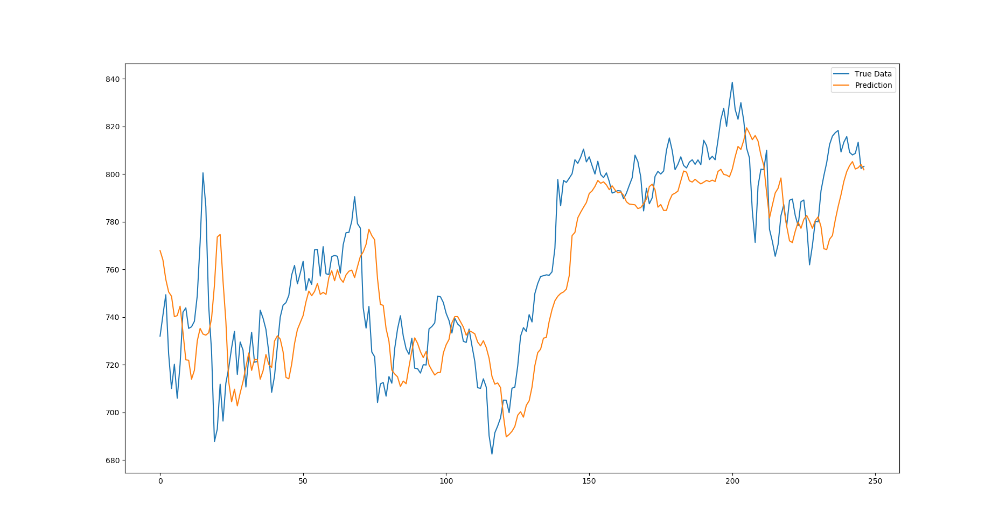

# State Frequency Memory Recurrent Network (Pytorch)
This project is the **pytorch** implementation version of State Frequency Memory Recurrent Network. [[Paper]](http://www.eecs.ucf.edu/~gqi/publications/kdd2017_stock.pdf)

The implementation process refers to the original author code(keras ver).[[Code]](https://github.com/z331565360/State-Frequency-Memory-stock-prediction)    
In addition to the SFM model, the LSTM model is built in for comparison.

## Usage
The project has pre-trained weights fot both two models. So you can see the test results directly without training.    
Training process be controlled by adding parameters.   
Parameter tables:     

|Parameter  | Explanation |format|default|
|------------- | ------------- |--------------|--------|
|epochs  | training epochs|int|10|
|step  | predict step    |int|5|
|net   | choose the network you want to train or test   |str|"sfm"|
|train | train or not |int| 0|
|test | test or not | int|1|

**Examples:**
- Want to show the prediction results of the SFM network:    
  ```  python main.py  --net=sfm ```  
- Want to train and test the LSTM:    
  ```  python main.py  --net=lstm --train=1 --test=1 --epochs=10 --step=5 ```

Supplementary explanation:
 - LSTM default hidden size is 50.SFM default hidden size is 50,and frequency size is 20.
 - The test process predicted all stocks but the visualization only shows the first one.
 - The model has not been carefully adjusted and has not used complicated tricks to get the best training results.
## Requirements
- pytorch == 0.4.0
- python == 3.6

## Test Result Display
- SFM --step=5 --epochs=10    

- LSTM --step=5 --epochs=10
 
